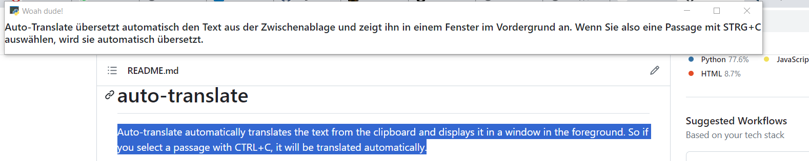

# auto-translate

Auto-translate automatically translates the text from the clipboard and displays it in a window in the foreground. So if you select a passage with CTRL+C, it will be translated automatically.




## Installation
```
pip install -r requirements.txt
```

Create deepl api key `config/config.yaml`

```
deepl:
  api_key: <deepl-api-key>
```


## Usage


### Start
```
python auto-translate.py --input-language en --output-language de
```
